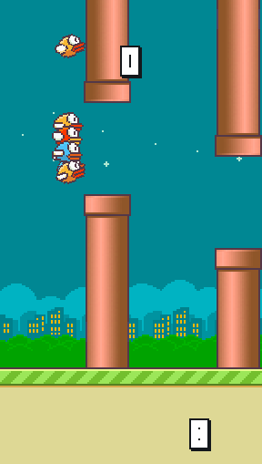

FlappyBird Genetic Algorithm
===============

Genetic Algorithm on FlappyBird game. Made using [python-pygame][1]. Forked original game from [sourabhv][2].

### Implementation
When the first round starts ,10 birds each follow a differnt randomly initialized neural network to determine when to flap. The inputs to the neural network are:
1) The horizontal distance from the bird to the nearest pipe.
2) The vertical distance from the bird to the middle of the next gap (between the upper and lower pipes).

A bird flaps if the output of the neural net > 0.8. Also at the begining of the each round, each bird only flaps according to its neural network once it has gotten close enough to the first pipe. Before this, the flaps are automatated.

After each generation, crossover and mutation is applied to all but the best bird. The best bird (fitness function) is defined by the bird that traveled the furthest distance (score & width to next pipe) in all the rounds. The crossover currently takes the best bird and breeds it at a rate of 0.9 with a mutation rate of 0.05 (these can be easiliy changed). 

From generation to generation the best bird continues to improve until converging at the (close to) optimal neural network that allows the best bird to play the game perfectly. This can be seen in the video demo below.

[1]: http://www.pygame.org
[2]: https://github.com/sourabhv

ScreenShots
----------
Note the score in the bottom right corner represents the current generation.

Video Demo
----------
Not the best video quality, but it can be seen that over 40 generations the best bird learns to play Flappy Bird almost perfectly:

https://www.youtube.com/watch?v=xfXqg3T5piY

Try it Yourself
--------------

1. Install Python 2.7.X or 3.5.x from [here](https://www.python.org/download/releases/)

2. Install PyGame 1.9.X from [here](http://www.pygame.org/download.shtml)

3. Clone this repository: `git clone https://github.com/cdamore/Flappy-Bird-Genetic-Algorithm.git` or click `Download ZIP` in right panel and extract it.

4. Run `python flappy.py` from the repo's directory

5. use <kbd>Space</kbd> key to start and <kbd>Esc</kbd> to close the game.

  (Note: Install pyGame for same version python as above)

  (For x64 windows, get exe [here](http://www.lfd.uci.edu/~gohlke/pythonlibs/#pygame))
